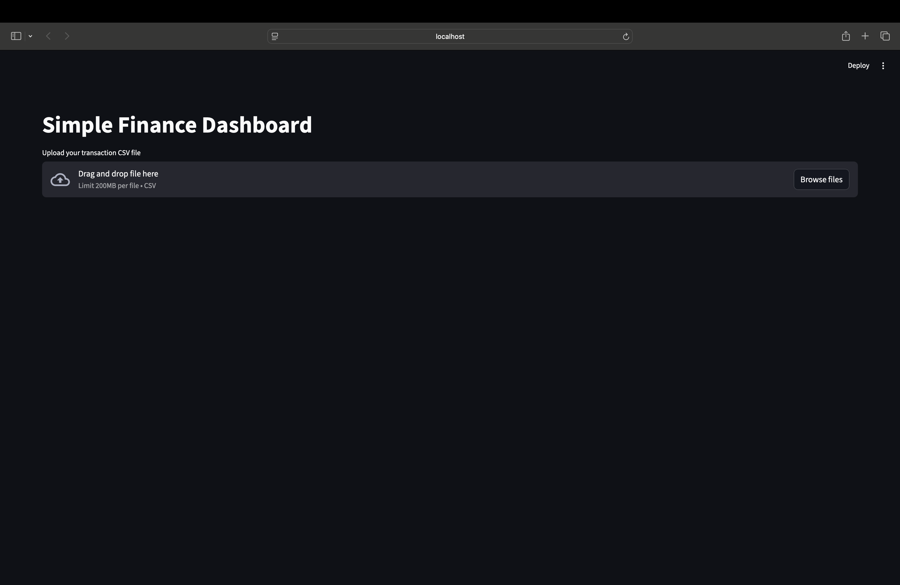
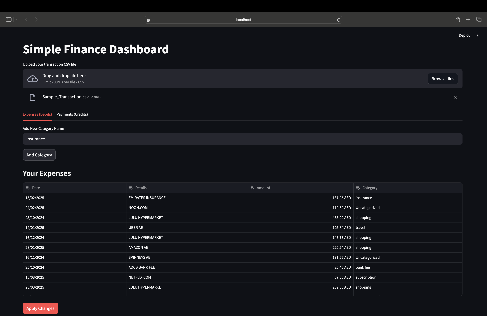

# PersonalFinance-with-Python 💰

[](LICENSE)  
[]()

A lightweight personal finance tracker built with Python.  
Easily log income and expenses, categorize transactions, and analyze spending with summaries and reports.

---

## 📋 Table of Contents

- [Features](#-features)  
- [Screenshots](#-screenshots)  
- [Getting Started](#-getting-started)  
- [Usage](#-usage)  
- [Project Structure](#-project-structure)  
- [Configuration & Data Files](#-configuration--data-files)  
- [Requirements](#-requirements)  
- [Roadmap](#-roadmap)  
- [Contributing](#-contributing)  
- [License](#-license)  

---

## ✨ Features

- Log daily **income** and **expenses**
- Assign transactions to **custom categories**
- View **summaries** by category and date range
- Store transactions in simple **CSV & JSON files**
- Minimal dependencies, fast and easy to extend

---

## 🖼 Screenshots

### Adding a Transaction (CSV Entry)


### Adding Categories


### Viewing a Summary


---

## 🚀 Getting Started

### 1. Clone the repository
```bash
git clone https://github.com/Sahdevnyc/PersonalFinance-with-Python.git
cd PersonalFinance-with-Python
